## Registrazioni di alcune lezioni

| Argomenti                                               |                                                              | Video                                                        |
| ------------------------------------------------------- | ------------------------------------------------------------ | ------------------------------------------------------------ |
| Esercizi sulla forza normale, tensioni tangenziali      | 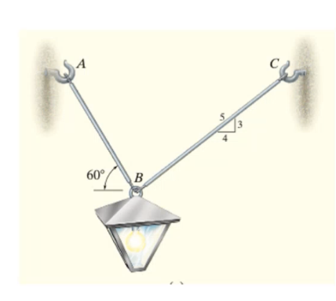 | [Meeting in _General_-20230925_093120-Meeting Recording.mp4](https://uniroma3.sharepoint.com/:v:/s/AA2324-SCIENZADELLECOSTRUZIONI-20810131TOMASSETTI/Ec5mx7qM4TBDu4PbIdQDFJABPVJzQXXnA2mjjie-fZKpmA?e=0hLzPs&nav=eyJyZWZlcnJhbEluZm8iOnsicmVmZXJyYWxBcHAiOiJTdHJlYW1XZWJBcHAiLCJyZWZlcnJhbFZpZXciOiJTaGFyZURpYWxvZyIsInJlZmVycmFsQXBwUGxhdGZvcm0iOiJXZWIiLCJyZWZlcnJhbE1vZGUiOiJ2aWV3In0sInBsYXliYWNrT3B0aW9ucyI6eyJzdGFydFRpbWVJblNlY29uZHMiOjMuMTh9fQ%3D%3D) |
| Trave caricata assialmente                              | 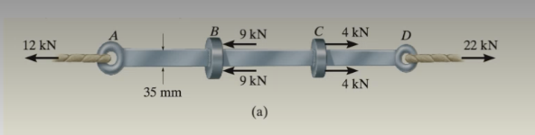 | [Meeting in _General_-20230925_093120-Meeting Recording.mp4](https://uniroma3.sharepoint.com/:v:/s/AA2324-SCIENZADELLECOSTRUZIONI-20810131TOMASSETTI/Ec5mx7qM4TBDu4PbIdQDFJABPVJzQXXnA2mjjie-fZKpmA?e=Doupac&nav=eyJyZWZlcnJhbEluZm8iOnsicmVmZXJyYWxBcHAiOiJTdHJlYW1XZWJBcHAiLCJyZWZlcnJhbFZpZXciOiJTaGFyZURpYWxvZyIsInJlZmVycmFsQXBwUGxhdGZvcm0iOiJXZWIiLCJyZWZlcnJhbE1vZGUiOiJ2aWV3In0sInBsYXliYWNrT3B0aW9ucyI6eyJzdGFydFRpbWVJblNlY29uZHMiOjQzMy4xNn19) |
| Esercizi sulla tensione tangenziale (senza audio)       | 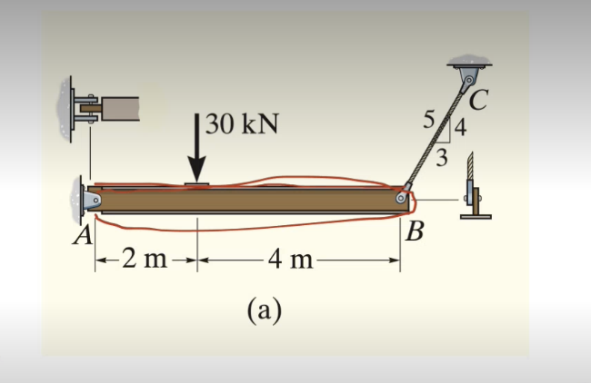 | [Meeting in _General_-20230926_081337-Meeting Recording.mp4](https://uniroma3.sharepoint.com/:v:/s/AA2324-SCIENZADELLECOSTRUZIONI-20810131TOMASSETTI/Eeo34QU7uVdKhq1enMPHnvgBnAE_sxE4NlyRIOm7cabzjw?e=0nfwfy&nav=eyJyZWZlcnJhbEluZm8iOnsicmVmZXJyYWxBcHAiOiJTdHJlYW1XZWJBcHAiLCJyZWZlcnJhbFZpZXciOiJTaGFyZURpYWxvZyIsInJlZmVycmFsQXBwUGxhdGZvcm0iOiJXZWIiLCJyZWZlcnJhbE1vZGUiOiJ2aWV3In0sInBsYXliYWNrT3B0aW9ucyI6eyJzdGFydFRpbWVJblNlY29uZHMiOjUyOC4yOX19) |
| Travature reticolari                                    | 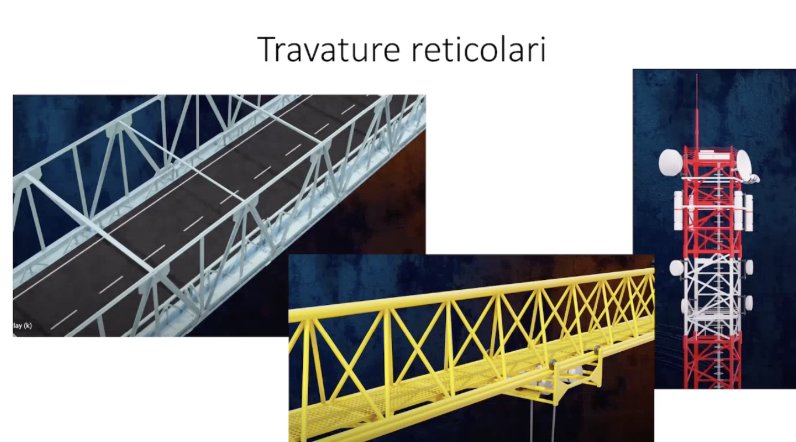 | [Meeting in _General_-20230926_172950-Meeting Recording.mp4](https://uniroma3.sharepoint.com/:v:/s/AA2324-SCIENZADELLECOSTRUZIONI-20801971TOMASSETTI/EU9vrWaH7wVGoYaEM8X3QO0BbrCtc--bV0KtDIsVCdQSZQ?e=9jgv9E&nav=eyJyZWZlcnJhbEluZm8iOnsicmVmZXJyYWxBcHAiOiJTdHJlYW1XZWJBcHAiLCJyZWZlcnJhbFZpZXciOiJTaGFyZURpYWxvZyIsInJlZmVycmFsQXBwUGxhdGZvcm0iOiJXZWIiLCJyZWZlcnJhbE1vZGUiOiJ2aWV3In0sInBsYXliYWNrT3B0aW9ucyI6eyJzdGFydFRpbWVJblNlY29uZHMiOjEwNS42OH19) |
| Trasformazione delle tensioni e circonferenze di Mohr   | 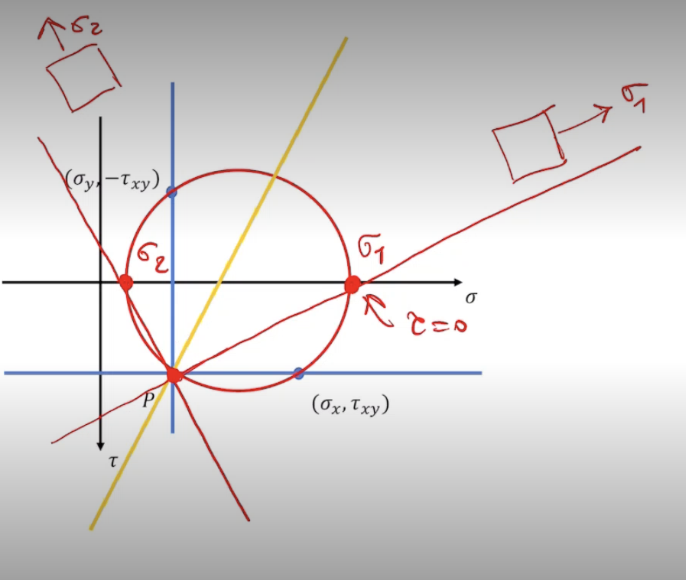 | [Meeting in General-20230929_143922-Meeting Recording.mp4](https://uniroma3.sharepoint.com/:v:/r/sites/AA2324-SCIENZADELLECOSTRUZIONI-20810131TOMASSETTI/Documenti condivisi/General/Recordings/Solo visualizzazione/Meeting in General-20230929_143922-Meeting Recording.mp4?csf=1&web=1&e=OHbMeL&nav=eyJyZWZlcnJhbEluZm8iOnsicmVmZXJyYWxBcHAiOiJTdHJlYW1XZWJBcHAiLCJyZWZlcnJhbFZpZXciOiJTaGFyZURpYWxvZyIsInJlZmVycmFsQXBwUGxhdGZvcm0iOiJXZWIiLCJyZWZlcnJhbE1vZGUiOiJ2aWV3In0sInBsYXliYWNrT3B0aW9ucyI6eyJzdGFydFRpbWVJblNlY29uZHMiOjIwNS4xfX0%3D) |
| Esempio costruzione cerchio di mohr                     | 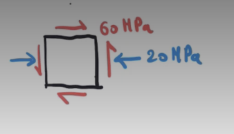 | [Meeting in General-20230929_143922-Meeting Recording.mp4](https://uniroma3.sharepoint.com/:v:/s/AA2324-SCIENZADELLECOSTRUZIONI-20810131TOMASSETTI/Eedy1oRLW4pHhZNNTlenLssBSYjegwAq1VxxD1qcFRFlIg?e=5F4LOY&nav=eyJyZWZlcnJhbEluZm8iOnsicmVmZXJyYWxBcHAiOiJTdHJlYW1XZWJBcHAiLCJyZWZlcnJhbFZpZXciOiJTaGFyZURpYWxvZyIsInJlZmVycmFsQXBwUGxhdGZvcm0iOiJXZWIiLCJyZWZlcnJhbE1vZGUiOiJ2aWV3In0sInBsYXliYWNrT3B0aW9ucyI6eyJzdGFydFRpbWVJblNlY29uZHMiOjM4OTMuODZ9fQ%3D%3D) |
| Esempio 2 costruzione cerchio di Mohr                   | 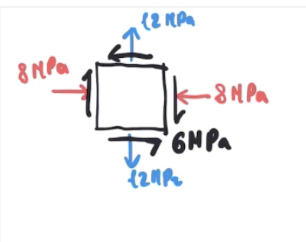 | https://uniroma3.sharepoint.com/:v:/s/AA2324-SCIENZADELLECOSTRUZIONI-20810131TOMASSETTI/Eedy1oRLW4pHhZNNTlenLssBSYjegwAq1VxxD1qcFRFlIg?e=DhqwjV&nav=eyJyZWZlcnJhbEluZm8iOnsicmVmZXJyYWxBcHAiOiJTdHJlYW1XZWJBcHAiLCJyZWZlcnJhbFZpZXciOiJTaGFyZURpYWxvZyIsInJlZmVycmFsQXBwUGxhdGZvcm0iOiJXZWIiLCJyZWZlcnJhbE1vZGUiOiJ2aWV3In0sInBsYXliYWNrT3B0aW9ucyI6eyJzdGFydFRpbWVJblNlY29uZHMiOjUyMzMuMjV9fQ%3D%3D |
| Criteri di resistenza per stati di tensione piani       | 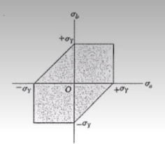 | [Meeting in General-20230929_143922-Meeting Recording.mp4](https://uniroma3.sharepoint.com/:v:/s/AA2324-SCIENZADELLECOSTRUZIONI-20810131TOMASSETTI/Eedy1oRLW4pHhZNNTlenLssBSYjegwAq1VxxD1qcFRFlIg?e=beobqs&nav=eyJyZWZlcnJhbEluZm8iOnsicmVmZXJyYWxBcHAiOiJTdHJlYW1XZWJBcHAiLCJyZWZlcnJhbFZpZXciOiJTaGFyZURpYWxvZyIsInJlZmVycmFsQXBwUGxhdGZvcm0iOiJXZWIiLCJyZWZlcnJhbE1vZGUiOiJ2aWV3In0sInBsYXliYWNrT3B0aW9ucyI6eyJzdGFydFRpbWVJblNlY29uZHMiOjcxNzEuMTZ9fQ%3D%3D) |
| Caratteristiche della sollecitazione in 3D              | 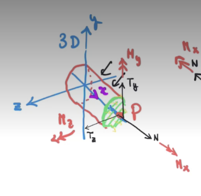 | [Meeting in General-20230929_143922-Meeting Recording.mp4](https://uniroma3.sharepoint.com/:v:/s/AA2324-SCIENZADELLECOSTRUZIONI-20810131TOMASSETTI/Eedy1oRLW4pHhZNNTlenLssBSYjegwAq1VxxD1qcFRFlIg?e=3WFh1p&nav=eyJyZWZlcnJhbEluZm8iOnsicmVmZXJyYWxBcHAiOiJTdHJlYW1XZWJBcHAiLCJyZWZlcnJhbFZpZXciOiJTaGFyZURpYWxvZyIsInJlZmVycmFsQXBwUGxhdGZvcm0iOiJXZWIiLCJyZWZlcnJhbE1vZGUiOiJ2aWV3In0sInBsYXliYWNrT3B0aW9ucyI6eyJzdGFydFRpbWVJblNlY29uZHMiOjgyNTYuNjR9fQ%3D%3D) [Meeting in General-20231004_080931-Meeting Recording.mp4](https://uniroma3.sharepoint.com/:v:/s/AA2324-SCIENZADELLECOSTRUZIONI-20801971TOMASSETTI/EbABA4e-5KRHirpEQFOxc20BNwgdtXrRR55l4uEakQHuog?e=bygdGK&nav=eyJyZWZlcnJhbEluZm8iOnsicmVmZXJyYWxBcHAiOiJTdHJlYW1XZWJBcHAiLCJyZWZlcnJhbFZpZXciOiJTaGFyZURpYWxvZyIsInJlZmVycmFsQXBwUGxhdGZvcm0iOiJXZWIiLCJyZWZlcnJhbE1vZGUiOiJ2aWV3In0sInBsYXliYWNrT3B0aW9ucyI6eyJzdGFydFRpbWVJblNlY29uZHMiOjc4Ljk2fX0%3D) |
| Esempio calcolo caratteristiche della sollecitazione 3d | 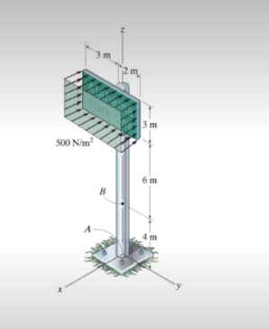 | [Meeting in General-20230929_143922-Meeting Recording.mp4](https://uniroma3.sharepoint.com/:v:/s/AA2324-SCIENZADELLECOSTRUZIONI-20810131TOMASSETTI/Eedy1oRLW4pHhZNNTlenLssBSYjegwAq1VxxD1qcFRFlIg?e=FM7opv&nav=eyJyZWZlcnJhbEluZm8iOnsicmVmZXJyYWxBcHAiOiJTdHJlYW1XZWJBcHAiLCJyZWZlcnJhbFZpZXciOiJTaGFyZURpYWxvZyIsInJlZmVycmFsQXBwUGxhdGZvcm0iOiJXZWIiLCJyZWZlcnJhbE1vZGUiOiJ2aWV3In0sInBsYXliYWNrT3B0aW9ucyI6eyJzdGFydFRpbWVJblNlY29uZHMiOjg2NTMuNTZ9fQ%3D%3D) [Meeting in General-20231004_080931-Meeting Recording.mp4](https://uniroma3.sharepoint.com/:v:/s/AA2324-SCIENZADELLECOSTRUZIONI-20801971TOMASSETTI/EbABA4e-5KRHirpEQFOxc20BNwgdtXrRR55l4uEakQHuog?e=za25Bo&nav=eyJyZWZlcnJhbEluZm8iOnsicmVmZXJyYWxBcHAiOiJTdHJlYW1XZWJBcHAiLCJyZWZlcnJhbFZpZXciOiJTaGFyZURpYWxvZyIsInJlZmVycmFsQXBwUGxhdGZvcm0iOiJXZWIiLCJyZWZlcnJhbE1vZGUiOiJ2aWV3In0sInBsYXliYWNrT3B0aW9ucyI6eyJzdGFydFRpbWVJblNlY29uZHMiOjMyNy40Nn19) |
| Caratteristiche della sollecitazione per travi piane    | 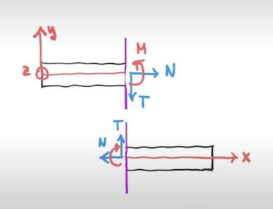 | [Meeting in General-20230929_143922-Meeting Recording.mp4](https://uniroma3.sharepoint.com/:v:/s/AA2324-SCIENZADELLECOSTRUZIONI-20810131TOMASSETTI/Eedy1oRLW4pHhZNNTlenLssBSYjegwAq1VxxD1qcFRFlIg?e=HwARgu&nav=eyJyZWZlcnJhbEluZm8iOnsicmVmZXJyYWxBcHAiOiJTdHJlYW1XZWJBcHAiLCJyZWZlcnJhbFZpZXciOiJTaGFyZURpYWxvZyIsInJlZmVycmFsQXBwUGxhdGZvcm0iOiJXZWIiLCJyZWZlcnJhbE1vZGUiOiJ2aWV3In0sInBsYXliYWNrT3B0aW9ucyI6eyJzdGFydFRpbWVJblNlY29uZHMiOjk5MjkuNTZ9fQ%3D%3D) [Meeting in General-20231004_080931-Meeting Recording.mp4](https://uniroma3.sharepoint.com/:v:/s/AA2324-SCIENZADELLECOSTRUZIONI-20801971TOMASSETTI/EbABA4e-5KRHirpEQFOxc20BNwgdtXrRR55l4uEakQHuog?e=fenD65&nav=eyJyZWZlcnJhbEluZm8iOnsicmVmZXJyYWxBcHAiOiJTdHJlYW1XZWJBcHAiLCJyZWZlcnJhbFZpZXciOiJTaGFyZURpYWxvZyIsInJlZmVycmFsQXBwUGxhdGZvcm0iOiJXZWIiLCJyZWZlcnJhbE1vZGUiOiJ2aWV3In0sInBsYXliYWNrT3B0aW9ucyI6eyJzdGFydFRpbWVJblNlY29uZHMiOjIzMTAuNzJ9fQ%3D%3D) |
| Esempio di calcolo delle CdS in una trave piana.        | 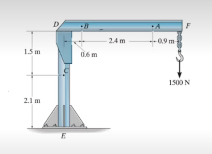 | [Meeting in General-20230929_143922-Meeting Recording.mp4](https://uniroma3.sharepoint.com/:v:/s/AA2324-SCIENZADELLECOSTRUZIONI-20810131TOMASSETTI/Eedy1oRLW4pHhZNNTlenLssBSYjegwAq1VxxD1qcFRFlIg?e=Daof1W&nav=eyJyZWZlcnJhbEluZm8iOnsicmVmZXJyYWxBcHAiOiJTdHJlYW1XZWJBcHAiLCJyZWZlcnJhbFZpZXciOiJTaGFyZURpYWxvZyIsInJlZmVycmFsQXBwUGxhdGZvcm0iOiJXZWIiLCJyZWZlcnJhbE1vZGUiOiJ2aWV3In0sInBsYXliYWNrT3B0aW9ucyI6eyJzdGFydFRpbWVJblNlY29uZHMiOjEwMjcxLjkyfX0%3D) [Meeting in General-20231004_080931-Meeting Recording.mp4](https://uniroma3.sharepoint.com/:v:/s/AA2324-SCIENZADELLECOSTRUZIONI-20801971TOMASSETTI/EbABA4e-5KRHirpEQFOxc20BNwgdtXrRR55l4uEakQHuog?e=FfU3EL&nav=eyJyZWZlcnJhbEluZm8iOnsicmVmZXJyYWxBcHAiOiJTdHJlYW1XZWJBcHAiLCJyZWZlcnJhbFZpZXciOiJTaGFyZURpYWxvZyIsInJlZmVycmFsQXBwUGxhdGZvcm0iOiJXZWIiLCJyZWZlcnJhbE1vZGUiOiJ2aWV3In0sInBsYXliYWNrT3B0aW9ucyI6eyJzdGFydFRpbWVJblNlY29uZHMiOjI0NTIuNTZ9fQ%3D%3D) |
| Formula della flessione                                 | 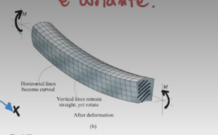 | [Meeting in _General_-20231003_162213-Registrazione della riunione.mp4](https://uniroma3.sharepoint.com/:v:/s/AA2324-SCIENZADELLECOSTRUZIONI-20810131TOMASSETTI/EcfAB-OhiNNFmiwVc1vDTlcBov2VByUuKREBc5g4wbhi4w?e=JZEOEh&nav=eyJyZWZlcnJhbEluZm8iOnsicmVmZXJyYWxBcHAiOiJTdHJlYW1XZWJBcHAiLCJyZWZlcnJhbFZpZXciOiJTaGFyZURpYWxvZyIsInJlZmVycmFsQXBwUGxhdGZvcm0iOiJXZWIiLCJyZWZlcnJhbE1vZGUiOiJ2aWV3In0sInBsYXliYWNrT3B0aW9ucyI6e319) |
| La formula del taglio                                   | 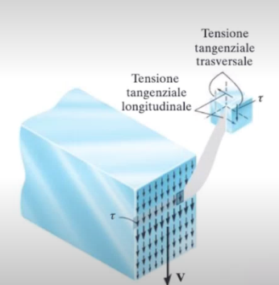 | [Meeting in _General_-20231003_162213-Registrazione della riunione.mp4](https://uniroma3.sharepoint.com/:v:/s/AA2324-SCIENZADELLECOSTRUZIONI-20810131TOMASSETTI/EcfAB-OhiNNFmiwVc1vDTlcBov2VByUuKREBc5g4wbhi4w?e=sZ3Nei&nav=eyJyZWZlcnJhbEluZm8iOnsicmVmZXJyYWxBcHAiOiJTdHJlYW1XZWJBcHAiLCJyZWZlcnJhbFZpZXciOiJTaGFyZURpYWxvZyIsInJlZmVycmFsQXBwUGxhdGZvcm0iOiJXZWIiLCJyZWZlcnJhbE1vZGUiOiJ2aWV3In0sInBsYXliYWNrT3B0aW9ucyI6eyJzdGFydFRpbWVJblNlY29uZHMiOjE1MzguMDd9fQ%3D%3D) |
|                                                         |                                                              |                                                              |
|                                                         |                                                              |                                                              |
|                                                         |                                                              |                                                              |

| Argomento                                                    | Immagine                                                     | Collegamento                                                 |
| ------------------------------------------------------------ | ------------------------------------------------------------ | ------------------------------------------------------------ |
| Tracciamento dei diagrammi delle caratteristiche della sollecitazione | 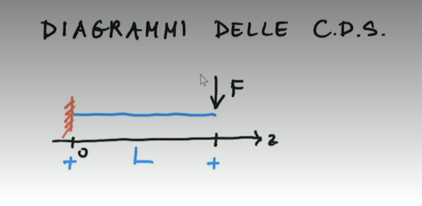 | [SDC ING MECC Recupero Via Teams-20211015_061642-Meeting Recording.mp4](https://uniroma3.sharepoint.com/:v:/s/AA2122-SCIENZADELLECOSTRUZIONI-20801971TOMASSETTI/EQ2hu_BsNvxPi2C7VbAI5CwB9pkQLEC_tbMXoGiH0QAvXQ?e=5wUgjC&nav=eyJyZWZlcnJhbEluZm8iOnsicmVmZXJyYWxBcHAiOiJTdHJlYW1XZWJBcHAiLCJyZWZlcnJhbFZpZXciOiJTaGFyZURpYWxvZyIsInJlZmVycmFsQXBwUGxhdGZvcm0iOiJXZWIiLCJyZWZlcnJhbE1vZGUiOiJ2aWV3In0sInBsYXliYWNrT3B0aW9ucyI6eyJzdGFydFRpbWVJblNlY29uZHMiOjYwOS4yNH19) |
| Diagrammi delle caratteristiche della sollecitazione in una struttura |  | [SDC ING MECC MARTEDI 8-10 AULA N1-20211026_061820-Meeting Recording.mp4](https://uniroma3.sharepoint.com/:v:/s/AA2122-SCIENZADELLECOSTRUZIONI-20801971TOMASSETTI/Ea_w-RlrLRBBrHJMiv4UAj8BaSl0ZCDUnPbd29gePygo6w?e=FgEdg5&nav=eyJyZWZlcnJhbEluZm8iOnsicmVmZXJyYWxBcHAiOiJTdHJlYW1XZWJBcHAiLCJyZWZlcnJhbFZpZXciOiJTaGFyZURpYWxvZyIsInJlZmVycmFsQXBwUGxhdGZvcm0iOiJXZWIiLCJyZWZlcnJhbE1vZGUiOiJ2aWV3In0sInBsYXliYWNrT3B0aW9ucyI6eyJzdGFydFRpbWVJblNlY29uZHMiOjYuNTZ9fQ%3D%3D) |
| Esercizio 9.9 Casini-Vasta                                   | 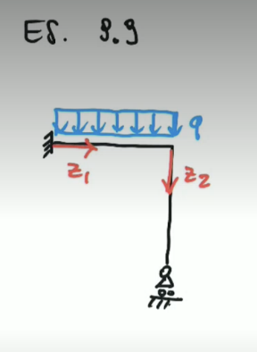 | [SdC Ing MEcc N01 martedi -20211123_075745-Meeting Recording.mp4](https://uniroma3.sharepoint.com/:v:/s/AA2122-SCIENZADELLECOSTRUZIONI-20801971TOMASSETTI/ER1si0chfsJOvPhQ5peIA9gBMRaxo1R0W6-HWbChz8bMYw?e=anVIYm&nav=eyJyZWZlcnJhbEluZm8iOnsicmVmZXJyYWxBcHAiOiJTdHJlYW1XZWJBcHAiLCJyZWZlcnJhbFZpZXciOiJTaGFyZURpYWxvZyIsInJlZmVycmFsQXBwUGxhdGZvcm0iOiJXZWIiLCJyZWZlcnJhbE1vZGUiOiJ2aWV3In0sInBsYXliYWNrT3B0aW9ucyI6eyJzdGFydFRpbWVJblNlY29uZHMiOjk0LjY2fX0%3D) |
|                                                              |                                                              |                                                              |

