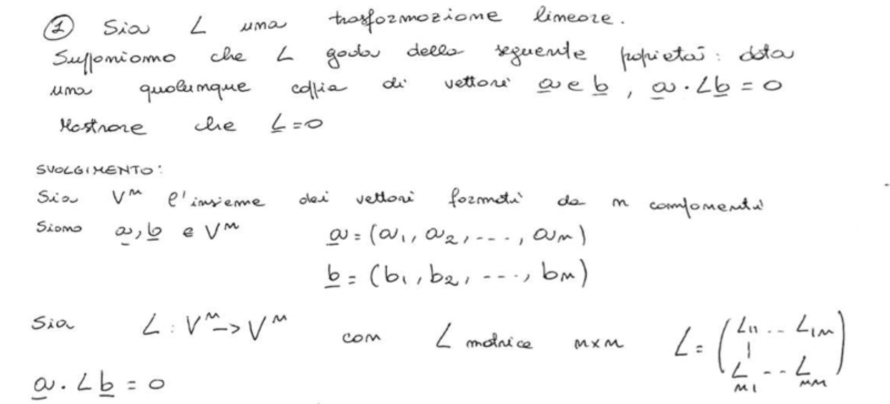
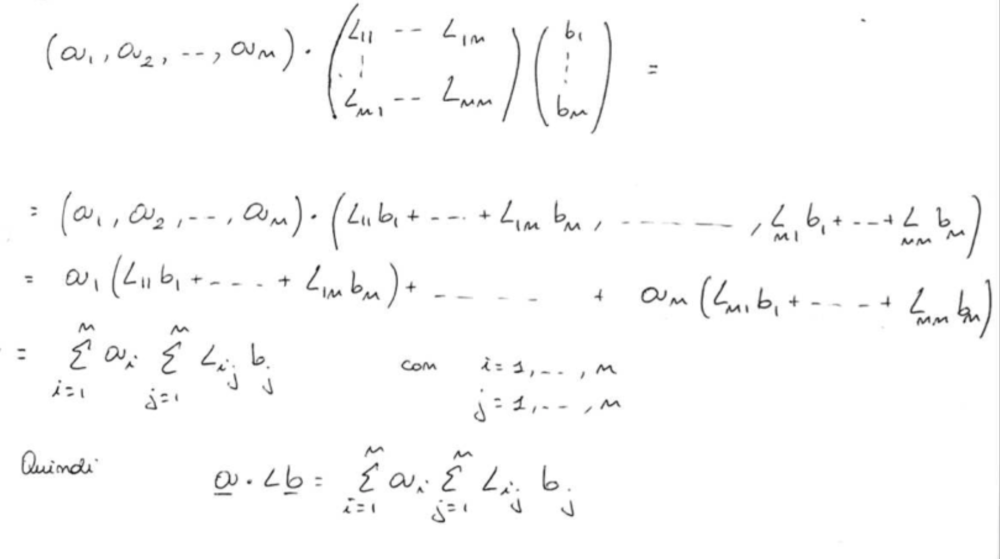
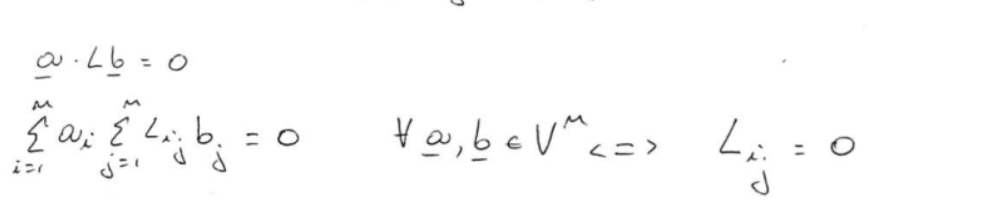

# Regole per la stesura dello svolgimento dei problemi

Come regola generale, le esercitazioni devono essere redatte **come se si trattasse dell'esposizione della risoluzione di un problema su un libro di testo**. 

#### Indicatori

- Completezza dell'esposizione: capacità di includere nel testo tutti gli elementi necessari alla comprensione del discorso.
- Sintesi, cioè capacità di evitare di includere nel testo elementi non necessari alla comprensione.
- Rigore espositivo, inteso come capacità di concatenare le argomentazioni in modo che siano ciascuna una conseguenza logica dell'altra.
- Rispetto delle regole della grammatica.
- Rispetto delle regole della costruzione del periodo.
- Utilizzo corretto del vocabolario.
- Correttezza dimensionale dei calcoli.
- Correttezza numerica dei calcoli.

Si consiglia, prima di consegnare il compito, di far leggere il testo ad un collega affinché esprima un voto su ciascuno dei punti sopra elencati. Si ribadisce che questi indicatori saranno adoperati in sede di valutazione delle prove scritte. È quindi importante tenerli presenti durante la redazione dei compiti a casa.

#### Struttura del testo

Anche se contiene formule e figure, lo svolgimento di un problema deve essere un testo strutturato secondo le regole della grammatica e della sintassi della lingua italiana. In particolare:

1. Vanno rispettate le regole della punteggiatura. (Indicazione “punteggiatura”)
2. **Ogni singola parola** che presente nel compito deve far parte di una **proposizione**, ovvero, di frase di senso compiuto.
3. Ogni proposizione deve far parte di un periodo, essere correttamente collocata in un contesto sintattico (essere collegata con le altre frasi da opportune congiunzioni.
4. **Le formule matematiche vanno trattate come frasi**. Come tali, devono essere collegate con il resto del periodo da opportuni costrutti. Ciò vale anche se la formula è collocata “in mostra”, come spiegato più avanti.
5. Le regole della punteggiatura valgono anche se un periodo contiene delle formule (in particolare, ogni periodo che termini con una formula deve essere delimitato da un punto).
6. Il flusso degli argomenti e delle formule deve essere lo stesso di un tema: dall'inizio della pagina fino in fondo; evitare di fare riferimento a formule che appaiono sotto, a destra o a sinistra.
7. i simboli devono essere essere definiti prima di essere adoperati.
8. ogni passaggio deve essere argomentato e giustificato, richiamando sinteticamente le eventuali nozioni pregresse necessarie alla sua interpretazione, citando una fonte bibliografica (a meno che non si tratti di nozioni elementari insegnate nei corsi di base) oppure facendo riferimento alle lezioni.

#### Utilizzo delle formule “in mostra”

Per quanto riguarda il posizionamento delle formule nel testo occorre fare la seguente precisazione: nelle regole redazionali di uso corrente è ammesso che una formula matematica, pur facendo parte di una frase, costituisca l'unico elemento di una riga, eventualmente accompagnata da una numerazione all'estremo di destra della riga in questione. Si dice che tale formula appare “in mostra”.

Le formule in mostra sono un accorgimento tipografico utile — se non indispensabile — qualora sia necessario riferirsi ad una formula in punti successivi del testo. Tale accorgimento viene adoperato per mettere in evidenza i passaggi fondamentali di una certa argomentazione. Non esiste una regola per stabilire se una formula appaia in mostra oppure no. Troppe formule tra le righe rendono difficoltoso seguire una argomentazione matematica. Troppe formule in mostra richiano di disorientare il lettore.

Sta all'abilità di chi scrive scegliere la combinazione migliore di formule in mosttra e formule tra le righe. Di norma, bisogna decidere in anticipo quali sono le formule sulle quali vogliamo che cada l'occhio del lettore e nascondere tra le righe le formule che, pur essendo necessarie per comprendere i passaggi tra due formule esibite in mostra, non veicolano concetti importanti.

## Griglia di valutazione degli elaborati

Gli elaborati previsti nel corso e nell'esame sono essenzialemnte di due tipi: svolgimento di un problema che preveda una risposta quantitativa (ad esempio, un problema o un esercizio); svolgimento di un tema o risposta ad un quesito che preveda una risposta di tipo qualitativo (ad esempio, una domanda o un problema sulla teoria). Nel secondo caso, le aree di valutazione sono solo le prime tre e i pesi vanno rinormalizzati in modo che la loro somma dia 100 (ossia, vanno moltiplicati per 100/45).

Elemento di valutazione degli elaborati:

|Area|Indicatori|Peso|
|---|---|---|
|Chiarezza espositiva|Intellegibilità e pulizia della grafia.   Formattazione del testo.   Organizzazione della esposizione.   Consequenzialità delle argomentazioni.|20%|
|Proprietà di linguaggio|Aderenza alle regole della grammatica e della sintassi.   Uso corretto del vocabolario.   Padronanza della terminologia tecnica.|15%|
|Capacità di sintesi|Capacità di sfruttare lo spazio consentito.   Capacità di selezionare le argomentazioni pertinenti alla traccia.   Capacità di selezionare i dettagli rilevanti.|15%|
|Correttezza qualitativa|Correttezza dei procedimenti adoperati per giungere ad un dato risultato.   Capacità di dare risposte adoperando considerazioni di carattere qualitativo.   Padronanza delle dimensioni fisiche.   Utilizzo corretto delle cifre significative.|15%|
|Correttezza quantitativa|Capacità di approssimare l'ordine di grandezza.   Capacità di approssimare il valore.|25%|

  

## Un esempio

Si riporta un esempio di analisi di un compito svolto a casa.

Per quanto riguarda la forma, osserviamo che:

- La calligrafia è buona e intellegibile. Emerge in maniera molto chiara la cura dell'autore per la grafia. Le parole sono ben distanziate e i margini sono ben definiti.
- Nel terzo periodo manca una virgola dopo $L:V^n\to V^n$ e un articolo indeterminativo prima della parola “matrice”. Inoltre, la formula $L=\begin{pmatrix}L_{11}\ldots L_{1n}\\\\L_{n1}\ldots L_{nn}\end{pmatrix}$, che è una frase, non costituisce un periodo, poiché non circoscritta dalla punteggiatura, né fa parte di un periodo più ampio, poiché non è collegata alle altre frasi tramite una qualche congiunzione; tale frase si pone dunque al di fuori del contesto sintattico.
- Per quanto riguarda l'impaginazione, si rileva che alcune frasi (nella fattispecie, le formule $\mathbf a=(a_1,\ldots, a_n)$) sono collocate in modo da rendere equivoca la loro appartenenza ad un eventuale periodo.
- Si rileva la mancanza dei punti di chiusura alla fine del periodo (Indicazione punteggiatura). Essendo questo errore ripetuto sistematicamente, il docente non lo interpreta come una svista.

Osservazioni sul contenuto.

- Dal terzo periodo traspare un errore concettuale: l'autore confonde una matrice, ovvero una tabella di scalari, con una generica applicazione da $V^n$ a $V^n$, senza peraltro indicare che la applicazione in questione è lineare (senza questa ipotesi non possiamo pensare a $\mathbf L$ come a una matrice). Sarebbe stato corretto dire che $L:V^n\to V^n$ è una trasformazione lineare e che la matrice $\mathbf L$ ne costituisce la rappresentazione in una base.
- Il fatto che nel terzo periodo l'autore abbia ripetuto parte dell'enunciato posto all'inizio della pagina manifesta l'intenzione di riproporre nello svolgimento i dettagli dell'enunciato stesso. Il lettore si aspetta dunque che i periodi con cui inizia lo svolgimento del compito rappresentino una riscrittura delle ipotesi dell'enunciato che si vuole dimostrare. In questo contesto, la frase sintetizzata nella formula $\mathbf a\cdot\mathbf L\mathbf b=0$, posta in fondo, ha un significato equivoco: non essendo inserita in un contesto sintattico come frase subordinata, essa **rappresenta una affermazione da interpretarsi come ipotesi su $\mathbf a$, $\mathbf b$, e $\mathbf L$**, a fronte di una ipotesi che riguarda solamente $\mathbf L$. L'autore ci sta dicendo che ha scelto $\mathbf a$ e $\mathbf b$ in modo che $\mathbf a\cdot\mathbf L\mathbf b=0$.

Osservazioni sulla forma:

- Inserire il punto tra il vettore riga $\mathbf a^T=(a_1,\ldots,a_n)$ e il vettore colonna ottenuto moltiplicando la matrice $\mathbf L$ per il vettore $\mathbf b$ è concettualmente sbagliato, dato che il prodotto scalare tra vettori riga e vettori colonna non è definito. Risulta definito il prodotto riga per colonna tra il vettore riga $\mathbf a^T$ e il vettore colonna $\mathbf L\mathbf b$:

$$ \mathbf a^T\mathbf L\mathbf b. $$ Risulta anche definito il prodotto $$ \mathbf a\cdot\mathbf L\mathbf b. $$ Non risulta però definito il prodotto $\mathbf a^T\cdot\mathbf L\mathbf b$.

- Specificare, in fondo alla prima formula, che gli indici $i$ e $j$ variano tra $1$ e $n$ è sia superfluo che dannoso. È superfluo perché l'intervallo di variazione di questi indici è sottinteso nel loro impiego sotto i simboli di sommatoria. È dannoso perché il lettore, vedendo la specifica di un intervallo per l'indice $i$ in fondo alla formula si aspetta che quell'indice siano liberi, anziché muti, e che la formula sia vera solo se i valori di quei indici cadono in un determinato intervallo.

Osservazioni sulla forma:

- Ancora una volta, non si capisce il nesso sintattico tra le frasi contenute in questo frammento di compito. Come sono scelti i vettori $\mathbf a$ e $\mathbf b$? Sono vettori arbitrari?

Osservazioni sul contenuto:

- Quello che probabilmente l'autore intende essere l'ultimo periodo del compito, non è altro che una riscrittura dell'enunciato da dimostrare. Dunque il compito è da intendersi non svolto.

Valutazione sintetica:

- Chiarezza espositiva: insufficiente.
- Proprietà di linguaggio: insufficiente.
- Capacità di sintesi: sufficiente.
- Correttezza qualitativa: insufficiente.
- Correttezza quantitativa: non valutata.
- Valutazione complessiva: insufficiente.